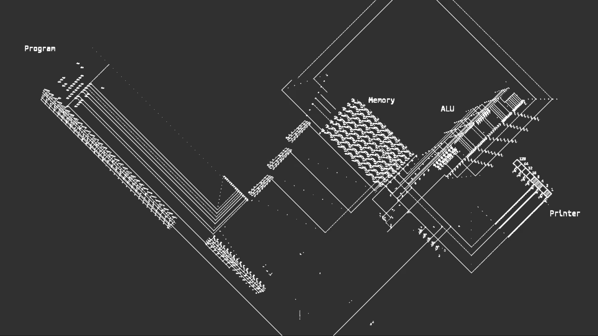

# A computer in Conway’s game of life



This is a computer built in Conway’s game of life.

An improved version with a pixel display is available here : [https://github.com/nicolasloizeau/scalable-gol-computer](https://github.com/nicolasloizeau/scalable-gol-computer)

The computer can be programmed with the Golly script `assembly.py`
(Golly: http://golly.sourceforge.net/ [http://golly.sourceforge.net/](http://golly.sourceforge.net/))


Programing instructions are in assembly.py

- folder `logic gates` contains logic gates
- folder `tools` contain tools for making adapters between logic gates

For a more detailed explaination, check [https://www.nicolasloizeau.com/gol-computer](https://www.nicolasloizeau.com/gol-computer) 


# Programming

Run `assembly.py` with Golly to program the computer

programing instructions:

There are only 8 variables names: `a,b,c,d,e,f,g,h`
`h` is used for storing the current program line, so be carefull, modifiying `h` will jump to the line `h+1`
the instructions are:
```
(let be n an integer in base 10)

write a n
-> write n to the variable a (written in 2's complement if signed)

goto n
-> go to the line n (first line is line 0)

move a b
-> b=a

jumpif a
-> jump the next line if a is not 0

print a
-> print a

add a b c
-> c=a+b

or a b c
-> c=bitwiseOR(a,b)

and a b c
-> c=bitwiseAND(a,b)

xor a b c
-> c=bitwiseXOR(a,b)

not a b
-> b=bitwiseNOT(a)

flat a b
-> b=0 if a=0; b=11111111 else

sign a b
-> write the most significant bit of a in b (sign of a if a is written in 2's complement)

increment a
-> a=a+1
```

This example computes the Fibonacci sequence
```
write a 1
write b 1
add a b a
print a
add a b b
print b
goto 2
```
